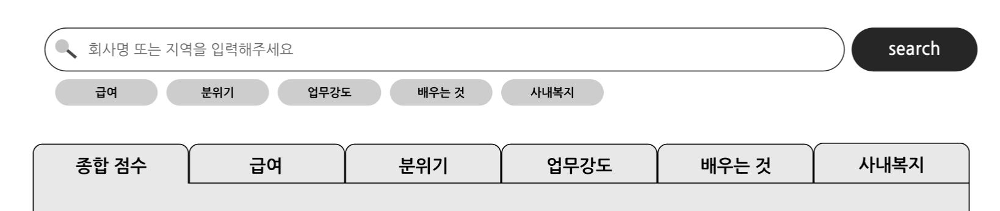

#### Team Sparkling Fondue _Low-fi Prototype Report_  

# Introduction

Our third milestone for our project, Cracker, was to create a Low-fi Prototype. Our goal for this milestone was to cost-efficiently create a prototype using a prototyping tool in order to test our core user experience along with usability issues to look out for in our UI. By using a tool, we can quickly create a prototype before investing in backend programming to create a functional prototype and we can also immediately rearrange our UI according to user feedback. In order to fully utilize this process, we needed to be sure on our design goals, and the scope of the prototype that we wanted to test. Our report explains our decision making and execution of these processes.

# Problem Statement

We decided that moving forward, it would be advantageous to select a narrower problem statement than what we said in our ideation phase. Back then, we needed to be open to pivots and evolution of our initial ideas so it was appropriate to have a broader, motivation based problem statement. Now, we felt like a task centric problem statement would help us focus as we move ahead with micro-decisions.

### Problem Statement
Students don’t have enough information to decide on a good internship.   

# Tasks

The next step was to isolate the three core tasks we hope to implement in order to solve our problem. Our process of identifying these tasks was to imagine user scenarios to first identify motivations for using our service. Then we would name the correlating task to each of these motivations. Using a user scenario is also advantageous because we can prioritize our tasks based on which type of user is more common or needs more help.

-----

## Task 1
Find and learn about internships that fit your preferences.

#### User Scenario  
> “I don’t know what internships exist or what I should do to help me”  

#### Priority 1
> This type of user would be the least experienced and need the most guidance with visual cues and thus require UI priority

-----

## Task 2
Confirm or sway your opinion about the company that you are interested in by finding detailed information.

#### User Scenario  
> “I know what company I’m interested in but I need more information on their internship program” 

#### Priority 2
> This type of user has a direct path to the end goal and thus only requires a few clear indicators to efficiently lead them to their goal
  
-----

## Task 3
Share the experiences and opinions that you want to tell other students.

#### User Scenario  
> “I want to share my experiences with other students and help them find/avoid this good/bad internship”  

#### Priority 3
> This type of user is the most experienced and also has a possibility of having already used our service. Although motivating contribution and avoiding deterrents to contribution is critical to our success, we decided that this could be achieved with less design space than the other two tasks because of its relatively isolated nature.  
 

# Prototype
### P rototype Link
> [bit.ly/SF_Lowfi](http://bit.ly/SF_Lowfi)

### Tool Choice [Figma]

For the soft collaboration of teamwork, we searched for tools that support CSCW, especially tools that show who is working on which place in real-time. We have worked our documentation works in Google Docs, and Google Slide for presentation preparation and we noticed that simultaneous real-time visualization of cooperation enhances efficiency by aiding the natural division of labor and feedback oriented discussion with whoever is currently working on a certain area. Thus, we have chosen Figma that supports CSCW. Figma has similar interface with Photoshop and also supports a layering system that is familiar to teammates, so it was easier to learn and utilize.  
What didn’t work was that Figma only supports up to two collaborators in the free version. We solved this by creating a team account where we can all join to observe progress and add comments. We also used these accounts efficiently by discussing our prototype design in-depth while we were together. 

### Design Choices  

We chose not to implement most of our ease-of-life features because most of them required even more time to implement than the core important features. These would include subtle animations, and reactive designs for mobile and web that would be very difficult to express in a prototyping tool as well as with real code while not being crucial to the user experience. We also didn’t include search suggestions in the search bar for the same reason even though we hope to include it in the future. We decided that we should focus on refining the UI after user feedback gives us a clear priority list on what is most obstructive or helpful to the user tasks.  
We felt that the most important features we needed to include were a visible search bar, a filter where users could input their needs, a company page to view company information, and a way to input new reviews. These design choices were the bare minimum needed to perform all three of our core tasks. We felt that if there were too many pages and features, the user testing could return a lot of feedback on these extra features. By reducing our capabilities, we hoped to isolate any potential root problems before addressing issues with comfort. 

### Main Screenshots

#### main page
  

#### search result page
  

#### company info page
  

#### review modal
  

### Instructions
1. Follow the link to the prototype
2. On the top-right corner there is a play button that will start the interactive prototype
3. Starting at the main page perform the given task
4. After completing each task, restart the prototype from the main page  

* If you get lost, take note that the areas of the prototype that are interactive light up blue when a non-interactive area is clicked
* When testing, make sure to avoid explaining our functionalities and to sufficiently describe the tasks as motivation driven.

### Observations

Our observation process was strict. We wanted to see all of our design flaws from the eyes of a first time user so we only provided background information on the type of service, internship information, and excluded all information regarding how we expected a user to utilize our functional implementations.   
We divided our roles into an observer and a human computer. The observer would not interact with the user at all and focus only on recording every action of the user. The human computer would mechanically say “that function is not yet available” when the user clicked on an uninteractive area of our prototype and otherwise would remain quiet. The human computer would also have the role of determining when the user is too lost and give small hints only after the “lost” behavior has been sufficiently observed. These role designations are based on our experience from the CS374(Intro to HCI) class to balance objectivity with feasibility in our prototype testing.  
Our observations revealed a lot of issues with the UI being unintuitive. We classified these usability issues into three categories: Misinterpretation Issues, Identification Issues, and Discomfort Issues. Misinterpretation Issues are the times users had difficulty deducing the function of an interactive element. Identification Issues are when users couldn’t recognize the existence or an identity of an element even though after they discovered it, deduction of its purpose was not an issue. Discomfort Issues were when users understood the function of a UI element but it directly conflicted with the user’s needs or wants and caused discomfort.  

-----

#### Misinterpretation Issues

> Misinterpretation Issues are the times users had difficulty deducing the function of an interactive element.  

- (P1, P2, P3 / mid) For task 1, All three users showed hesitation and momentary confusion after inputting preference into our filter tags. It took time for them to realize that the search button needs to be clicked in order to apply their input.  
We believe this is caused by not having a strong enough indication of connection between the filter tags and the search button. Although the search bar and the filter tags are close, the search button is positioned on the same vertical as only the search bar. This two-step association (from filter tag to search bar to search button) probably caused difficulty in intuitively leading into search after inputting filter.   
We plan on taking inspiration from travel services with multiple input options before searching and visually tie in the search bar and the filters into one box. We will also increase the vertical length of the search button so that it is equally horizontal to both the bar and the filter tags.

- (P1, P2, P3 / mid) All users displayed confusion with the filter and search bar combination. At least once each they would attempt to input both before pressing search.  
We believe this happened because of the proximity of the two interfaces implying a strong connection. During the process of learning a new platform, a user naturally “experiments” multiple mental models but our failure was visually planting a strong association that conflicts with logical flow. Users knew that it didn’t make sense to use both functions at the same time but our designed forced them to second-guess themselves.  
We will create a clear division between the search bar and filter tags and also balance the visual weight and size to make them seem like equals rather than filter tags being a supporting feature to the search bar. By doing so we hope to show that they are both separate options for the user to choose.

- (P1, P2, P3 / high) For tasks 2 and 3, users were confused with the ordering of the search results after using the search bar.  
We believe this is because we introduce a scoring system before users have a chance to understand what it means and because users that use a text search expect the results to be in order to “relevance” or “similarity” based on their previous experiences and common conventions for search results.  
We plan on adjusting our design to initially follow the common convention of default order by relevance and make the search results more intuitive to browse.  
- (P1, P2, P3 / low) In the search results page, users were often confused seeing the search results tabs with the same keywords as the filter tags beneath the search bar. They were confused with what to expect from the tabs.  
We believe this was caused by a combination of the filter tag’s purpose being unintuitive to start with, and having no previous explanation of our scoring system. However, we also think that it’s an issue that something that looks so similar is too close to each other.  
We are planning on removing tabs and instead having the filter tags be more large and visible. We are also planning on making the filter tags instantly responsive so that they functionally act the same way as tabs while used within the search results page.  

-----

#### Identification Issues

> Identification Issues are when users couldn’t recognize the existence or an identity of an element even though after they discovered it, deduction of its purpose was not an issue.  

- (P1, P2 / mid) User1 and User2 had to move their faces closer to the screen to see what our timeline meant while User3 didn’t even bother to understand what the timeline was about. People would instead focus more attention on the timeline range control bar at the top.  
We think this is caused by the weak visual presence of the timeline graph. It has to compete with the colorful pentagram on the right, and the font size of the graph axis were to small.  
We are planning on switching the information to a bar graph. Even though we know that a line graph is traditionally better to show continuous progression, we feel like we can utilize the area of bars to make the Y-axis meaning more visible and also color the bars according to season to make the seasonal cycles more visible.
- (P1, P2 / mid) User1 and User2 both ended the prototype testing without once trying to click on the timeline control bar.  
We believe that people didn’t notice the timeline bar for two reasons. First, the bar itself had no pull for attention. It didn’t have a bright thick presence or any indication of movement such as a commonly identifiable drag bar or reactive feedback when a mouse passes over it. Second, the timeline was spaced overhead everything and therefore didn’t establish a personal correlation with what it was affecting.  
By repositioning and rescaling the timeline to correctly represent the area that it’s affecting, and by redesigning the size and shape of the timeline into a more obviously interactable form we hope to solve this issue. 

-----

#### Discomfort Issues

> Discomfort Issues were when users understood the function of a UI element but it directly conflicted with the user’s needs or wants and caused discomfort.  

- (P1 / high) Task 1 testing showed User1 attempting to look into the spotlight reviews on the main page rather than proceeding with the preference filters like we expected.  
We had underestimated the importance of being able to immediately browse reviews and companies before requiring preference input.  
We plan on expanding the scrolling area on the lower side of the main page to include a wider array of browsing options. We also plan on making them interactable reactively expand to user clicks because we observed all three user testers attempting to click on this area.  
- (P1, P2, P3 / high) After entering the company info page User2 and User3 would go to the bottom of the screen to look at the other user’s reviews right after the initial pause of skimming the page. User1 spent more time on trying to understand what the graph meant but also ended up spending more time trying to interact with the review section at the bottom of the page.  
We believe that this shows what users are more interested in. We had originally thought that a visual summary of the data would be a better way to start the company information page, but people were more interested in the voices of their peers, at least at first.  
We plan on adjusting the order of the information presented to accommodate the user’s needs. While we still want to highlight our main pentagram at the top, we will move the timeline down to the bottom for only deep-divers to see. We will position the popular reviews at the top for a more immediate read on how people feel about the internship.
- (P1, P2 / low) User1 and User2 both went back and forth between the Review Input window and the company info page before starting to input the reviews.  
We believe this was because people wanted to have open access to context and other people’s opinions before writing out their own. Things like the average opinion, average review length, the tone of the community in this website (allows some joking vs completely serious) are things people want to consider as they write a review. Not only that, but just being forced to memorize a lot of useful information is a hard cognitive load on the user that can create discomfort. 
- (P1, P2, P3 / mid) People hesitated when they needed to leave the star score in the review, especially at the section for salary.  
We believe this is because, different from naturally unquantifiable themes like atmosphere or learning opportunity, salary has a statistical scale. Although the value of these salaries can be subjective, it seemed difficult for a user to decide a score when they are in the position of sharing and informing this salary to other people with only a star score.  
We plan on replacing the star score input with a salary input. After receiving input we would assign a star score with an internal algorithm accounting for the distribution graph of internship salaries. 

